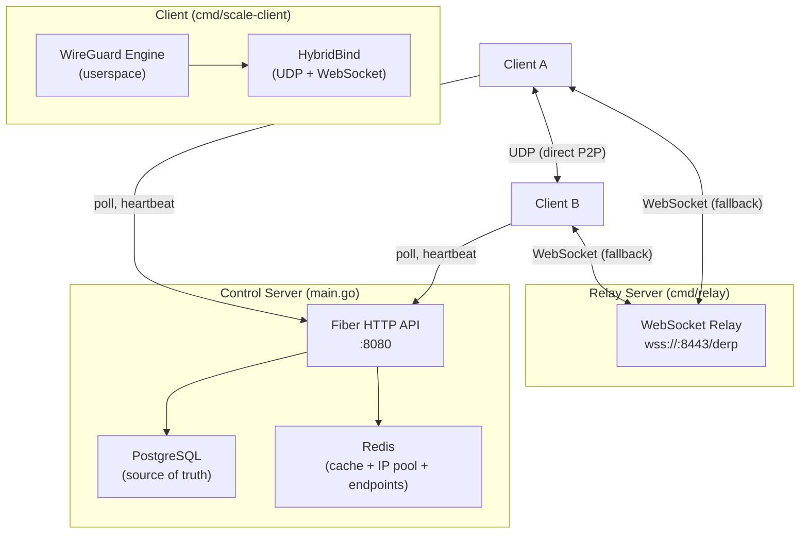
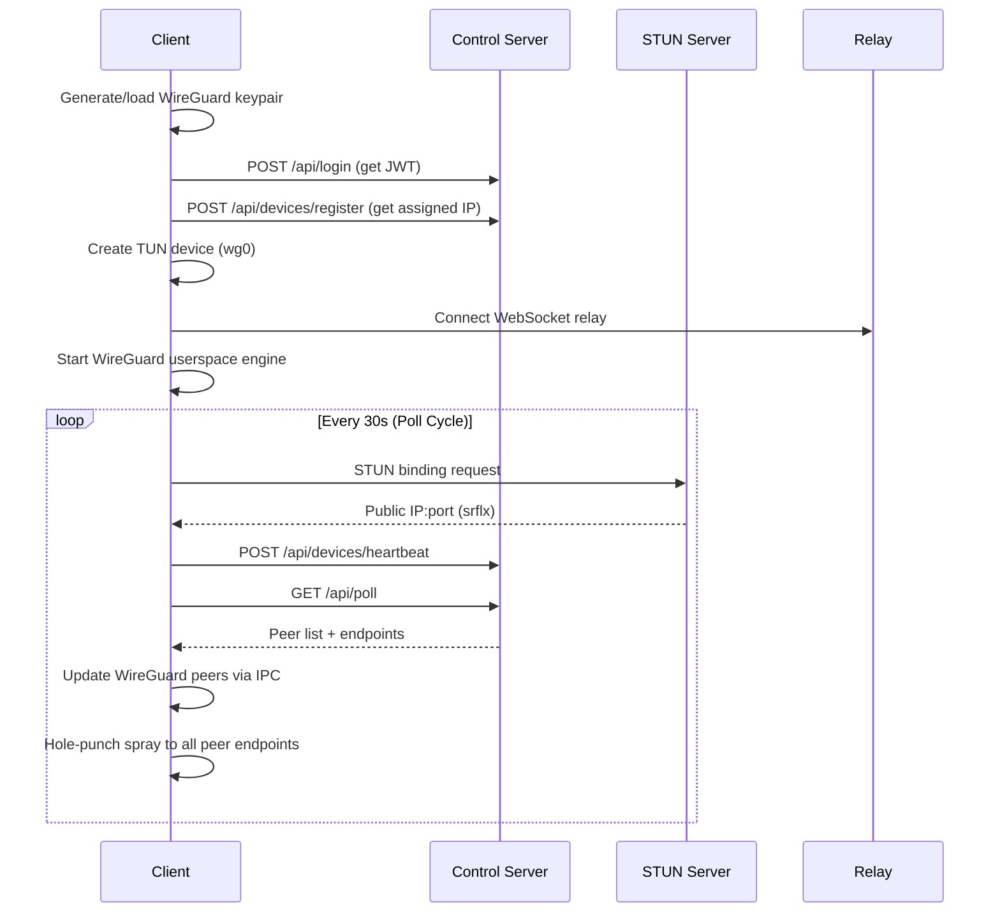

# Scale

Scale is a **Tailscale-alternative mesh VPN** built from scratch in Go. It creates a WireGuard-based overlay network where devices authenticate against a central control server, discover each other's endpoints, and establish encrypted peer-to-peer tunnels — with automatic fallback to a WebSocket relay when direct UDP connectivity fails.

> [!WARNING]
> **Proof of Concept.** This project is a learning build, not production software. See [Known Limitations](#known-limitations-poc-state) before relying on it for anything real.

---

## Overview

Scale is made of three cooperating binaries:

- **Control server** (`main.go`) — a Fiber HTTP API that handles user/device authentication, IP allocation, and peer-discovery via a poll model. Backed by PostgreSQL (source of truth) and Redis (cache, IP pool, live endpoints).
- **Relay server** (`cmd/relay`) — a DERP-style WebSocket relay used as a fallback data path when two peers can't establish a direct UDP tunnel (symmetric NAT, restrictive firewalls, etc).
- **Client** (`cmd/scale-client`) — a userspace WireGuard engine with a custom dual-path transport (`HybridBind`) that can move traffic between direct UDP and the WebSocket relay, plus STUN-based NAT discovery, hole punching, and a health monitor that drives automatic failover/recovery.



---

## Features

- Full control-plane + relay + client implementation in Go, no forked WireGuard tooling
- JWT-based user auth (bcrypt passwords) and device registration tied to a user account
- IP address allocation from a Redis-backed pool, currently sized as a `/16` (65,534 usable addresses)
- STUN-based public endpoint discovery (`stun.l.google.com:19302`) and UDP hole punching
- Custom `HybridBind` transport: a single `conn.Bind` that speaks both raw UDP and WebSocket, so WireGuard doesn't know or care which path is active
- Health monitoring with automatic UDP → relay failover and relay → UDP recovery
- Peer roaming detection (updates a peer's endpoint on the fly when its address changes)
- PostgreSQL fallback for peer/poll lookups if the Redis cache is cold or unavailable

---

## Repository Structure

```
main.go                          Control server entrypoint (Fiber API, cache warmup)
authentication/
  controllers/                   Auth, device, and STUN HTTP handlers
  middleware/                    JWT + device auth middleware
  routes/                        Route registration
database/                       PostgreSQL (GORM) + Redis clients, device store
ipmanager/                       Redis-backed IP pool allocation/release
handlers/, models/, repositories/, domain/   User/device models and supporting logic
internal/vpn/hybrid.go           HybridBind: dual UDP/WebSocket conn.Bind implementation
internal/util/                   JWT claims + token utilities
cmd/relay/main.go                Standalone WebSocket (DERP-like) relay server
cmd/scale-client/
  setup.go                       Client bootstrap, poll cycle, HealthMonitor, hole punching
  wg_dynamic.go                  Dynamic WireGuard peer/IPC configuration
benchmark/                       k6 load-test script + raw results
deploy/                          AWS EC2 deployment guide, systemd units, smoke test
project_info/                    Architecture notes, benchmarks, bug-chain writeups, changelog
```

---

## Control Server

The control server is the coordination plane only — it never forwards user traffic. It manages identity, IP allocation, and peer discovery so that clients can find each other and connect directly (or via relay).

| Component | Technology |
|-----------|-----------|
| HTTP framework | [Fiber](https://gofiber.io/) |
| Primary datastore | PostgreSQL via GORM |
| Cache / ephemeral state | Redis |
| Auth | JWT (HS256) + bcrypt password hashing |

### API Endpoints

| Method | Route | Auth | Purpose |
|--------|-------|------|---------|
| `POST` | `/api/register` | None | User registration (email + password) |
| `POST` | `/api/login` | None | Returns JWT token |
| `GET` | `/api/user` | JWT | Get current user info |
| `POST` | `/api/logout` | JWT | Clear JWT cookie |
| `POST` | `/api/devices/register` | JWT | Register a device (public key → assigned IP) |
| `POST` | `/api/devices/heartbeat` | JWT | Report device endpoints (host + STUN-discovered) |
| `GET` | `/api/devices/:id/peers` | JWT | Get peer config for a specific device |
| `GET` | `/api/poll` | JWT | **Primary client endpoint** — returns STUN token + full peer list with endpoints |
| `GET` | `/api/stun` | Token | Lightweight NAT type detection |

### Data Flow

1. **Device registration** — client sends its WireGuard public key; the server allocates an IP from the pool and persists the device in PostgreSQL.
2. **Heartbeat** — client periodically reports its local IPs and STUN-derived public `ip:port`; stored in Redis with a 90s TTL (`device:endpoints:<pubkey>`).
3. **Poll** — client fetches all peers and their cached endpoints, then builds its local WireGuard peer config.
4. **Device cache** — all devices are cached in Redis (`cache:all_devices`) on a synchronous warmup at boot, then refreshed every 10s by a background goroutine, with a PostgreSQL fallback if the cache is missing.

### Database Schema

**PostgreSQL** (GORM auto-migrate)

| Table | Fields |
|-------|--------|
| `users` | id, name, email (unique), password_hash, created_at, updated_at, deleted_at |
| `devices` | id, public_key (unique), assigned_ip (unique), endpoint, user_id, created_at, updated_at, deleted_at |

**Redis keys**

| Key pattern | Type | TTL | Purpose |
|-------------|------|-----|---------|
| `cache:all_devices` | String (JSON) | none | Cached device list from PostgreSQL |
| `device:endpoints:<pubkey>` | String (JSON) | 90s | Live endpoint list per device |
| `ip_pool:available` | Set | none | Available IPs for allocation |

---

## Client

A userspace WireGuard client with a custom networking layer designed to keep the tunnel alive across NATs and mid-session network changes.



### Key mechanisms

- **HybridBind** (`internal/vpn/hybrid.go`) — a custom `conn.Bind` implementation for WireGuard that handles both UDP (direct P2P) and WebSocket (relay) simultaneously, so the WireGuard engine is transport-agnostic.
- **STUN discovery** — uses a public STUN server to learn the client's server-reflexive (public) `ip:port`.
- **Endpoint selection priority** — LAN IPs → STUN (srflx) → first available candidate.
- **Hole punching** — sends a 5-round probe spray to all peer candidate endpoints to open NAT mappings.
- **Keepalives** — custom probe packets (magic `0xFF505242` + public key) sent every 5s per peer to maintain NAT bindings and detect liveness.
- **Health monitor** — tracks UDP send/probe failures; once a failure threshold is hit, it flips all peers over to the relay endpoint, and switches back once direct UDP is confirmed alive again.
- **Peer roaming** — detects when a peer's address changes (via probe responses) and updates the WireGuard endpoint dynamically.

### Custom protocol framing

| Protocol | Magic | Purpose |
|----------|-------|---------|
| WireGuard | `0x01`–`0x04` (first byte) | Normal WG handshake/data |
| STUN | `0x2112A442` (bytes 4–8) | NAT discovery |
| Probe / keepalive | `0xFF505242` (bytes 0–4), 36 bytes | Liveness + roaming detection |

---

## Relay Server

A minimal DERP-like WebSocket relay used only when direct UDP fails.

- Listens on `wss://:8443/derp` with TLS
- Auth via a `DERP_AUTH_KEY` query parameter
- Clients register by sending their 32-byte public key
- Packets are routed as `[dest_key(32B) | payload]` → server looks up the destination in its in-memory `clients` map → forwards as `[sender_key(32B) | payload]`
- Ping/pong keepalives with a 60s timeout
- Thread-safe client map cleanup (`sync.Once`)

---

## IP Allocation

- IPs are handed out from a Redis-backed pool (`ip_pool:available`), currently a **`/16`** block (`100.64.0.0/16`, CGNAT range) — 65,534 usable addresses.
- Allocation is an atomic `SPOP` from the Redis set; release is `SADD` back into it.
- Clients configure an on-link kernel route for the full `/16` so peer-to-peer traffic within the pool is reachable.
- **Note:** the pool is (re)initialized from a hardcoded CIDR and is not persisted independently of Redis — if Redis's `ip_pool:available` key is flushed or Redis is reset, the pool is rebuilt from the CIDR rather than reconciled against existing PostgreSQL device records.

---

## Benchmarks

Full raw output and environment details are in [`project_info/benchmarks.md`](project_info/benchmarks.md). Summary:

| Scenario | Environment | Result |
|---|---|---|
| **P2P mesh, direct UDP** (loopback) | Two local WireGuard clients, direct UDP path | Sustained **~40.0 Gbits/sec** over 10s, **zero retries** |
| **WebSocket relay fallback** (loopback) | Same setup, UDP blocked via `iptables`, forced over local relay | **~40.2 Gbits/sec average**, but with **severe per-second jitter** — dips as low as 934 Kbits/sec and 1.21–2.70 Gbits/sec in individual 1s windows |
| **Cross-NAT WAN mesh** (WiFi ↔ cellular hotspot) | Two laptops on separate NATs (home WiFi + Jio hotspot), AWS Mumbai relay + control server | Direct P2P tunnel established; **~0.077 ms average latency**, zero packet loss over 500+ pings |

**Key findings:**

- The custom userspace WireGuard engine (`HybridBind`) sustains theoretical loopback throughput with no packet loss on the direct UDP path, and a previously identified deadlock in `HybridBind` has been resolved.
- The relay fallback path matches average throughput but suffers from **GC-pressure-driven jitter** at high sustained throughput — pushing tens of Gbps through WebSocket frames triggers heavy allocation and Go garbage-collector "stop-the-world" pauses. The identified fix (not yet implemented) is `sync.Pool`-based buffer reuse in the relay and `HybridBind`'s WebSocket path to cut heap churn.
- Real cross-NAT testing surfaced a **route-flapping bug chain** in the health-monitor/failover logic (~26–34s oscillation between direct and relay). Root-caused to 5 chained bugs, most notably a recursive tunnel loop where the VPN's own overlay IP was mistakenly treated as a physical endpoint candidate. See [Known Limitations](#known-limitations-poc-state) for current status.
- After a clean device-registry purge, cross-NAT connectivity was stable: exactly 2 active peers, correct relay failover, and ~0.07ms tunneled latency with zero drops over 500+ packets.

There is also a k6 load-testing script for the HTTP control-plane API at [`benchmark/load-test.js`](benchmark/load-test.js) (see [`benchmark/results.txt`](benchmark/results.txt) for the latest run).

---

## Getting Started

### Prerequisites

- Go 1.23+ (toolchain pinned to 1.24.x in `go.mod`)
- PostgreSQL (control-plane source of truth)
- Redis (cache, IP pool, live endpoint storage)
- WireGuard kernel module or userspace tooling on client machines

### Build

```bash
git clone https://github.com/Sankalprai224/scale.git
cd scale

# Control server
go build -o scale-server ./main.go

# Relay
go build -o relay ./cmd/relay

# Client
go build -o scale-client ./cmd/scale-client
```

### Configuration

The control server and client both read from a `.env` file (via `godotenv`). At minimum you'll need:

```
JWT_SECRET=<random secret>
DEVICE_AUTH_SECRET=<random secret>
DATABASE_URL=<postgres connection string>
REDIS_ADDR=<redis host:port>
PORT=8080
DERP_AUTH_KEY=<shared relay auth key>
RELAY_URL=wss://<relay-host>:8443/derp?auth=<DERP_AUTH_KEY>
```

### Running locally

```bash
# 1. Start the control server
./scale-server

# 2. Start the relay
./relay

# 3. Run a client (register/login flow happens on first run)
./scale-client
```

### Docker

A multi-stage `dockerfile` is included for the control server (Go 1.23 Alpine builder → static binary on `alpine:latest`, exposing port 8080).

```bash
docker build -t scale-server .
docker run -p 8080:8080 --env-file .env scale-server
```

### Cloud deployment

A full AWS EC2 deployment guide (systemd units, TLS cert generation for the relay, firewall rules, and a smoke test script) is available in [`deploy/README.md`](deploy/README.md).

---

## Known Limitations (PoC State)

> [!WARNING]
> This is a learning/PoC project and is **not production-ready**. Several of these limitations are architectural and would need real design work — not quick patches — to resolve.

- **Configs are unsigned.** Clients trust the control server blindly; there's no signature verification on peer configs, which is an MITM risk.
- **Client keys are ephemeral.** WireGuard keypairs are regenerated on every client restart rather than persisted, so a device's identity/IP binding doesn't survive a restart cleanly.
- **`InsecureSkipVerify: true`** is set on the relay's WebSocket TLS connection.
- **No multi-user network isolation.** All devices are visible to all other devices regardless of which user owns them — there's no per-user or per-tailnet segmentation.
- **Single relay, no relay selection.** There's no multi-region relay set or geo-aware relay selection; if the one relay is unreachable, relay fallback has nowhere to go.
- **Relay-path throughput is unstable at high load.** Sustained high-throughput traffic over the WebSocket relay produces heavy jitter due to GC pressure from per-packet allocations; the fix (buffer pooling via `sync.Pool`) is identified but not yet implemented.
- **Health-monitor / failover logic has a known, partially-fixed bug chain.** A full route-flapping investigation (documented in [`project_info/healthmonitor_bugchain_v2.md`](project_info/healthmonitor_bugchain_v2.md)) identified 5 chained root causes:
  1. Missing `IpcSet` call in the UDP-recovery branch (recovery was gated behind the 30s poll cycle instead of happening immediately).
  2. `Send()` incorrectly resetting the failure counter on successful local socket writes, masking real path failures.
  3. Keepalive probes locked to a stale initial address, not updated on peer roaming.
  4. The client's own VPN overlay IP (`100.64.x.x`) being reported as a physical endpoint candidate, causing a recursive tunnel loop that produced false liveness signals.
  5. `lastPongTime`/`udpFailCount` being global on the `HybridBind` struct instead of tracked per-peer — meaning in a mesh with more than 2 devices, a healthy peer can mask a dead one.

  Bugs 1–4 were fixed and validated during investigation, but a fix for all of them together surfaced a **deeper issue**: once flapping was eliminated, the WireGuard data plane's endpoint could still be overwritten by the 30-second poll cycle after a roaming update, breaking the actual tunnel even though liveness probes looked healthy. Because of this, the code was **reverted to the pre-fix commit** (`23065f4`) and the fixes have not been reapplied to `main` yet — the bug chain and full fix designs are documented for a future dedicated pass, but the per-peer health-state refactor (item 5) and the poll-cycle/endpoint-cache reconciliation needed to ship items 1–4 safely are still outstanding.
- **`GetPeerConfig`** (`/api/devices/:id/peers`) does not yet have the same PostgreSQL fallback that was added to `/api/poll` — it can still fail on a cold Redis cache.
- **Benchmarks so far are limited.** The WAN benchmark validated latency and basic cross-NAT connectivity, not sustained throughput under real-world packet loss/jitter conditions; the relay-path jitter numbers come from a loopback test, not a live WAN run.

---

## License

This project is currently unlicensed. Reach out via GitHub issues for licensing inquiries.
