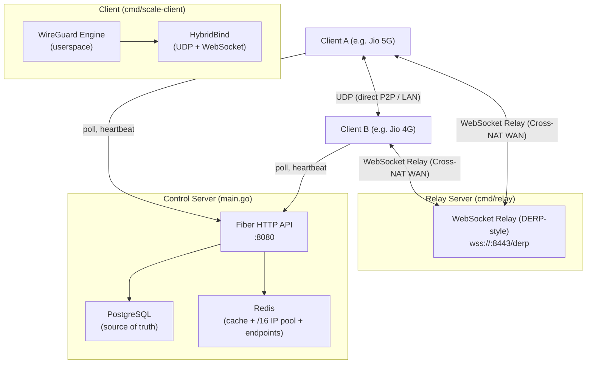
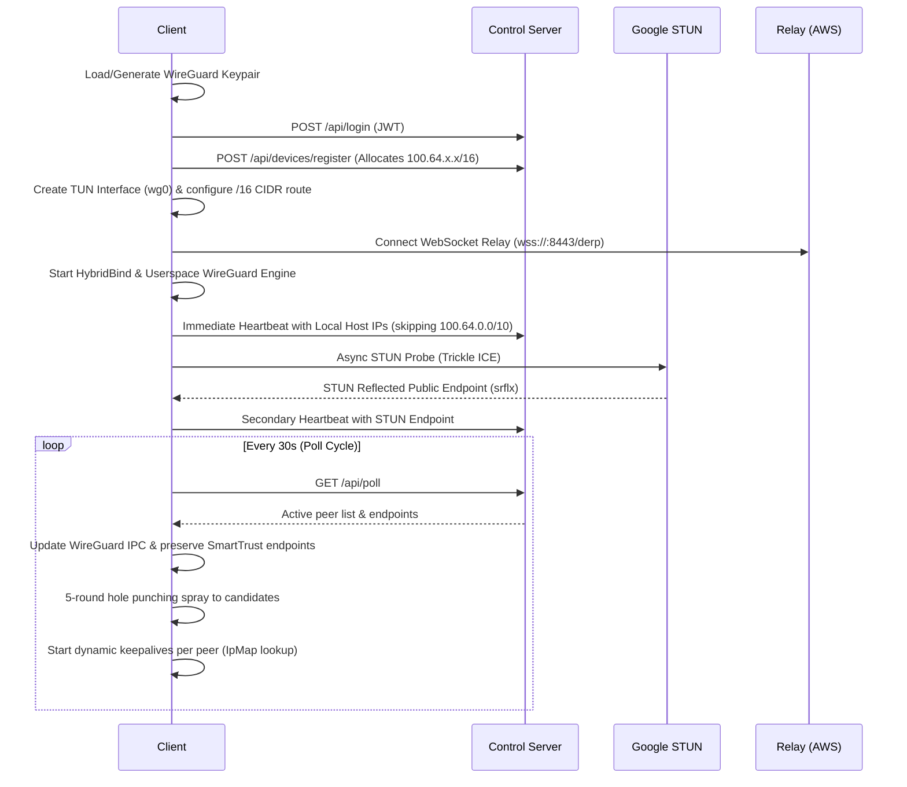

# Scale — Project Overview

**Scale** is a **Tailscale-alternative VPN** built from scratch in Go. It creates a WireGuard-based mesh network where devices connect via a central control server, discover each other's endpoints, and establish encrypted peer-to-peer tunnels — with automatic, non-blocking WebSocket relay fallback when direct UDP is blocked by Symmetric NAT / CGNAT.

---

## Architecture (3 Binaries)

---

## 1. Control Server (`main.go`)

The central coordination plane. It manages authentication, identity, IP allocation, and peer discovery without sitting in the data plane path.

### Tech Stack
| Component | Technology | Description |
|---|---|---|
| HTTP Framework | [Fiber](https://gofiber.io/) (Go) | High-performance HTTP server with express-like routing |
| Primary Database | PostgreSQL via GORM | Persistent source of truth for users and devices |
| In-Memory Cache | Redis | Distributed state, `/16` IP pool, and ephemeral endpoint cache |
| Authentication | JWT (HS256) + bcrypt | Stateless user & device authorization |

### API Endpoints

| Method | Route | Auth | Purpose |
|---|---|---|---|
| `POST` | `/api/register` | None | User registration (email + password) |
| `POST` | `/api/login` | None | Authenticates user and returns JWT |
| `GET` | `/api/user` | JWT | Get current user profile |
| `POST` | `/api/logout` | JWT | Clears session |
| `POST` | `/api/devices/register` | JWT | Registers device and allocates dynamic `/16` IP |
| `POST` | `/api/devices/heartbeat` | JWT | Reports local and STUN-discovered candidate endpoints (with user ownership validation) |
| `GET` | `/api/devices/:id/peers` | JWT | Peer configuration lookup (with Redis + Postgres fallback) |
| `GET` | **`/api/poll`** | JWT | **Primary coordination endpoint** — returns peer list, IP maps, and public endpoints |
| `GET` | `/api/stun` | Token | Lightweight NAT detection |

### Resilience & Scale Features
- **Synchronous Cache Population**: `refreshDeviceCache()` runs synchronously before server startup to prevent cold-start `/api/poll` 500 race conditions.
- **PostgreSQL Fallback**: Both `/api/poll` and `/api/devices/:id/peers` automatically fall back to querying PostgreSQL directly if Redis cache keys are evicted or unavailable.
- **Heartbeat Spoofing Protection**: `Heartbeat()` validates that the device's public key belongs to the authenticated user before accepting endpoint updates.

---

## 2. Client Architecture (`cmd/scale-client/`)

A standalone userspace WireGuard client featuring dynamic roaming, health monitoring, and cross-NAT failover.

### Startup & Discovery Flow

### Core Client Capabilities
- **HybridBind Engine** ([`internal/vpn/hybrid.go`](file:///home/sankalp/Documents/scale/internal/vpn/hybrid.go)): Custom implementation of WireGuard's `conn.Bind` interface that multiplexes raw UDP packets and encapsulated TLS WebSocket frames simultaneously.
- **Trickle ICE Candidate Updates**: Dispatches physical local IPs immediately on boot, fires STUN resolution asynchronously in the background, and pushes a secondary heartbeat with public endpoints once resolved.
- **SmartTrust Roaming & Two-Way Cache Sync**: Detects peer address changes from incoming verified probes, dynamically updating WireGuard endpoints and synchronizing `endpointCache` so that periodic poll cycles never clobber active connections.
- **Dynamic Keepalives**: `StartKeepAlives()` sends magic probes (`0xFF505242`) every 5 seconds, reading dynamic `IpMap` entries on every tick to follow roaming peers across networks.
- **State-Gated Recovery Hysteresis**: When a connection is marked dead, requires **3 consecutive healthy probe responses** (`udpSuccessCount >= 3`) before resetting fail counters, preventing route oscillation on lossy links.
- **HealthMonitor & Auto-Failover**: Evaluates per-peer failure counters. If 15s pong timeout occurs, smoothly transitions WireGuard traffic to the WebSocket relay. On recovery, executes `WgDevice.IpcSet` to restore direct UDP routing.
- **Tunnel Loop Prevention**: `getLocalIPs()` applies a strict CIDR filter (`100.64.0.0/10`) to exclude the VPN's own overlay interface from being advertised as a physical candidate.

---

## 3. Relay Server (`cmd/relay/`)

A high-throughput **DERP-style (Designated Encrypted Relay for Packets)** WebSocket relay designed for environments where direct P2P is structurally impossible (e.g. Symmetric NAT + CGNAT on Indian mobile carriers like Jio/Airtel).

- **Protocol**: TLS WebSocket on port `8443` (`wss://<host>:8443/derp?auth=...`).
- **Framing**: `[Destination Key (32B) | WireGuard Encrypted Frame]`.
- **Zero Decryption**: The relay routes raw ciphertext using destination public keys; payload encryption remains end-to-end between client WireGuard interfaces.
- **Thread Safety & Buffer Management**: Fine-grained mutex locking protecting socket writes without wrapping whole packet loops, preventing deadlock under heavy multi-megabyte streams.

---

## 4. IP Pool & Scalability (`ipmanager/`)

- **Expanded Subnet**: Migrated from a legacy `/24` block to a **`/16` CGNAT CIDR block (`100.64.0.0/16`)**, providing **65,534 usable IP addresses**.
- **Atomic Redis Allocation**: Available IPs are stored in a Redis set (`ip_pool:available`). IP allocation executes via atomic `SPOP`, and deallocation runs via `SADD`, preventing race conditions during concurrent device registrations.
- **On-Link Kernel Routing**: Configured with `100.64.0.0/16` subnet masking on client TUN devices, allowing direct routing across 20,000+ nodes in the same overlay namespace.

---

## 5. Validated Performance Benchmarks

Tested live across real cellular carriers (Lenovo on Jio 5G $\leftrightarrow$ Linux on Jio 4G via AWS EC2 Mumbai Relay):

| Benchmark Test | Traffic Profile | Live Result | Key Takeaway |
|---|---|:---:|---|
| **ICMP Ping Stability** | 100 packets over 100s | **96% Delivery / 0 Flaps** | Complete elimination of the 30s route flapping bug |
| **Round-Trip Latency** | Cellular Double-Hop | **333.3 ms avg (165.9 ms min)** | Consistent cross-WAN cellular transit |
| **Forward TCP Throughput** | 10s `iperf3` Stream (5G $\rightarrow$ 4G) | **3.56 Mbps (6.29 Mbps peak)** | **0 TCP Retransmissions** (`Retr: 0`) |
| **UDP Jitter & Loss** | 5.00 Mbps Stream (4,568 pkts) | **0.0% Loss / 8.12 ms Jitter** | Broadcast-grade stability suitable for VoIP/SSH |
| **Reverse TCP Throughput** | 10s `iperf3` Stream (4G $\rightarrow$ 5G) | **1.15 Mbps (4.19 Mbps peak)** | **0 TCP Retransmissions** across 4G uplink |
| **HTTP Application Layer** | Chrome Browser Directory Listing | **HTTP 200 OK** | Full Layer 7 rendering over `100.64.209.70:8000` |
| **10MB Binary Transfer** | Continuous `curl` streaming | **100% Bit-Perfect (105s duration)** | Zero resets or disconnects under sustained load |

---

## 6. Architecture & Security Notes

- **Symmetric NAT Handling**: Indian mobile carriers (Jio, Airtel, Vi) enforce Symmetric NAT + CGNAT. Direct P2P UDP hole-punching is structurally impossible on these networks due to random port re-mapping. Scale automatically detects this and routes traffic through the encrypted WebSocket DERP relay with zero data corruption.
- **End-to-End Encryption**: All traffic passing through the WebSocket relay is fully encrypted by WireGuard with ChaCha20-Poly1305. The relay operator cannot inspect, tamper with, or read network payloads.
